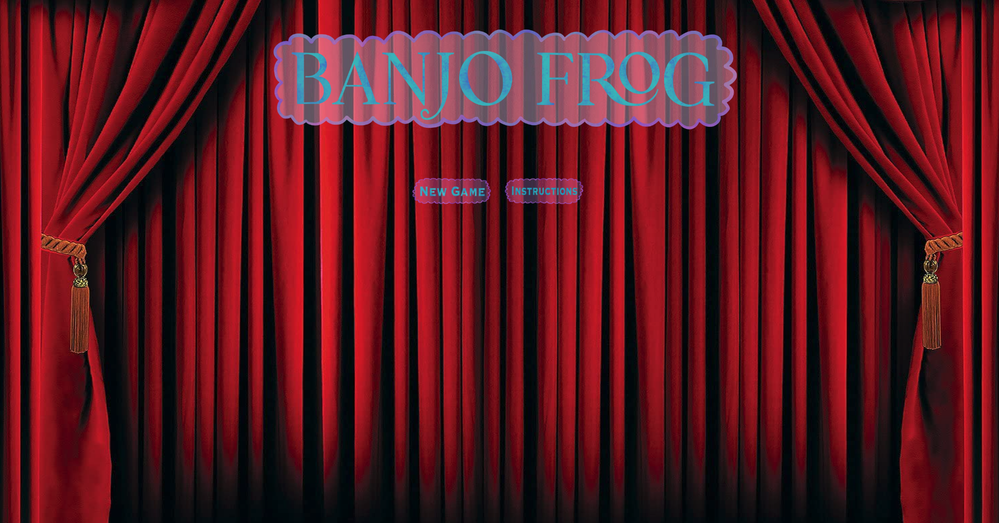

# Banjo Frog
[Banjo Frog](https://daniel-bogart.github.io/Banjo-Frog/) is an arcade-style web-based video game where users can simulate playing a banjo.

## Demo:
The live working demo can be found here: [Banjo Frog Demo](https://daniel-bogart.github.io/Banjo-Frog/)

## Site:
### Welcome Menu
The welcome menu features two clickable buttons. The New Game button will start the game and the instructions button will bring up the instructions modal.
Once the game is started, an audio button will also appear.


### Instructions
The instructions modal contains the game's premise as well as controls on how the game is played.


### Gameplay
The gameplay involves five seperate keys on the keyboard representing strings. Each key, correlated to a given string, must be pressed while a vertical note on a 
downward path crosses a horizontal plain. Ten points will be added to a total score for each hit, ten points subtracted for each wrong key press, and zero points for a miss.
After the song ends and the notes stop, one of four outcomes will be displayed for the player based on their final score.

* Less than 600 points: Poor
* Less than 800 points: Below Average
* More than 800 points: Above Average
* More than 900 points: Professional


## Featured Code:
### Game Controls
Banjo Frog uses fairly simple game controls, utilizing the keys, A, S, D, F, G. These controls are recorded using an event listener to track
keyup events to register a 'hit'. The notes flow along a vertical downward path, allowing for simple collision registration.

```
  window.addEventListener('keyup', (e) => {
    game.checkNotes(e.code);
    game.resetCurrentNote(e.code);
  });


  hitNote(note, e) {
      let horiz = note.pos[1]
      if (this.keys[e] === note.pos[0] && 
      (horiz > note.hitRange[0] && horiz < note.hitRange[1])) {
        return true
    }
  }

  checkNotes(e) {
    const currentNote = this.currentNote;
    this.hitNote = this.hitNote.bind(this);
    let notes = this.notes;
    if (notes.some(note => this.hitNote(note, e)) && currentNote[e] === 0) {
      this.notesHit += 1;
      this.score += 10;
      currentNote[e] += 1;
    } else {
      this.score -= 10;
      missNote.play();
    }
  }
```

A variable called 'currentNote' keeps track of the previous note to ensure that users cannot spam keys for extra points.
```
  resetCurrentNote(e) {
    const currentNote = this.currentNote
    setTimeout(() => currentNote[e] = 0, .5 * 1000);
    ;
  };
```

This is a code snippet of how the notes are generated and removed. The notes position is stored in local state.
```
  addNote() {
    const notes = ["note1", "note2", "note3", "note4", "note5"]
    const positions = ["pos1", "pos2", "pos3", "pos4", "pos5"];
    const note = notes[Math.floor(Math.random() * Math.floor(5))]
    const pos = positions[Math.floor(Math.random() * Math.floor(5))];
    this.notes.push(new Note(this.ctx, note, pos));
  }
  
  removeNote() {
    this.notes.shift();
  }
  
  
  generateNotes() {
    const addNote = this.addNote.bind(this);
    const removeNote = this.removeNote.bind(this);
    this.noteIntervalId = setInterval(function () {
      
      addNote();
      
      setTimeout(function () {
        removeNote();
      }, 30 * 1000)
    }, 800);
  };

  move() {
    this.pos[1] += 2.0;
  }
```